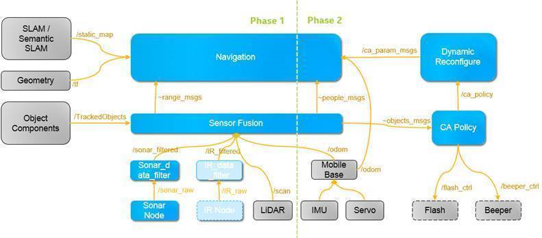

# Intelligent Collision Avoidance


This repo is the place holder for enhanced collision avoidance solution based on ROS system (highly
depend on navigation stack).

## What is Intelligent Collision Avoidance?

iCA (short for Intelligent Collision Avoidance) addresses the main functionalities of avoiding obstacles during robot
moving. _intelligent_ shows the differentiation to the legacy collision avoidance in existing ROS navigation stack.
That is, the solution adopts and enables new sensor inputs (such as range
sensor, RGB-D camera sensor, etc.) to extends the ability of common navigation by such points as:

- multi-sensor fusion depend on navigation plugin mechanism.
- different collision avoidance policy, accellerated by deep learning and object tracking.



In this design, we make Navigation as a sub-component in Intelligent Collision Avoidance component.
ROS Navigation stacke is adopted and updated by adding _navigation plugins_ to address versatile sensors' input (such as
sonar and RGB-D camera). _Sensor Fusion_ sub-component gathers each kind of sensor data and fuse them under the
specific needs from navigation or CA Policy.  _CA Policy_ sub-component arbitrates the suitable collision avoidance
policy according to the fused sensor data. Furthermore, _CA Policy_, through _Dynamic Reconfigure mechanism_, tells
navigation stack to update its global plan and local plan once the collision avoidance policy is changed. _Sonar Node_
takes as a wrapper for sonar sensor device, who talks to sonar device and wrap sonar device data into ROS topic.
_Sonar data filter_ sub-component takes charge of sonar data correct check and filtering.


## Directory Structure

### <i class="icon-upload"></i> turtlebot_navigation
This folder holds navigation customization for turtlebot2 robot base, as well our pre-analysis
result for POC robot base (say, water base) temporally.

### <i class="icon-upload"></i> water_navigation
This folder holds navigation customization for [Water Robot Base](www.yunji.com) robot base, as well our
pre-analysis result for POC robot base (say, water robot base) temporally.

### <i class="icon-upload"></i> sonar_filter
This folder holds the simple linear filtering algorithm implementation. Currently, the filtering
algorithm addresses the noise of sonar input, and filters them out.

### <i class="icon-upload"></i> ca_policy
This folder holds the implementation of analyzing camera based object info and generating ca policy messages, on which
the specific CA policy is enabled.


### <i class="icon-upload"></i> navigation_layers
This folder holds costmap2D plugins updated and/or created for AMR POC projects.

## Build Steps
This package was verified under Ubuntu 16.04 with ROS kinectic environment.

### 1. Make sure ROS dependencies and catkin tools ready for use
Follow [ROS Wiki](http://wiki.ros.org/ROS/Installation) and [catkin
tool](http://wiki.ros.org/catkin) to download related packages in your Linux machine.

> NOTE: Currently for AMR POC Demo, turtlebot_navigation package is ignored for catkin_make.
> If you want to use turtlebot base for debugging or demo use, please remove CATKIN_IGNORE under
> its folder before code building first.

### 2. Download code to your local storage
    mkdir -p ~/catkin_ws/src
    cd ~/catkin_ws/src
    git clone https://github.intel.com/otc-rse/AMR_ros_collision_avoidance.git
	cd AMR_ros_collision_avoidance/navigation_layers
	git submodule init
	git submodule update
	git checkout demo

### 3. Build code
    cd ~/catkin_ws
    catkin_make
> NOTE: _navigation layers_'s compiling depends on _navigation stack_. Before building it, please make sure navigation
> stack is already in the including paths. [AMR_ros_navigation](https://github.intel.com/otc-rse/AMR_ros_navigation)
> is recommended to use, in which some enhanced features are enabled.

### 4. Install Package
    cd ~/catkin_ws
    catkin_make install
> **NOTE:** navigation parameter files should be put into /opt/ca_policy folder before running ca_policy node.

  ```bash
       sudo mkdir -p /opt/ca_policy
       sudo cp -rf ~/catkin_ws/src/AMR_ros_collision_avoidance/ca_policy/ca_policy/param /opt/ca_policy/
  ```

### 5. Sourcing the ROS workspace
After building the workspace, source it via:
    source devel/setup.bash

## Security

For security issues, please send mail to wei.zhi.liu@intel.com
